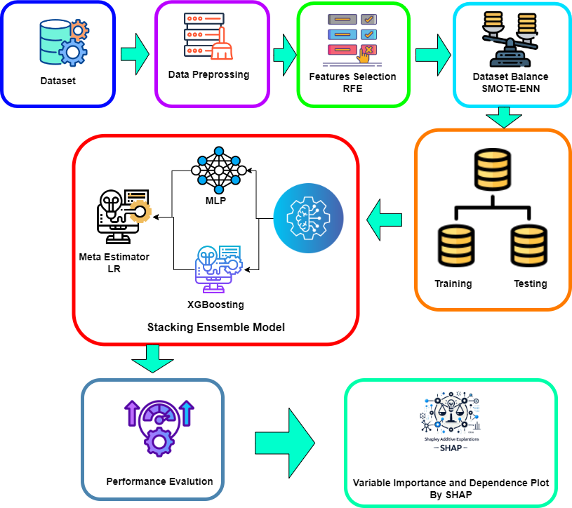

# 🧠 ThyroStack: A Stacking Model for Thyroid Disease Prediction


> A high-performance stacking ensemble model combining **XGBoost**, **MLP**, and **Logistic Regression** for accurate thyroid disease classification.

---

## 📌 Overview

Thyroid diseases affect millions globally. Early diagnosis is essential. **ThyroStack** proposes a novel stacking ensemble framework using:
- **MLP** and **XGBoost** as base models
- **Logistic Regression** as the meta-learner

Key features include:
- Class balancing using **SMOTE-ENN**
- **SHAP** for interpretability
- Achieved **99.78% accuracy**

---

## 📁 Dataset

- 📌 **Source**: [UCI Machine Learning Repository](https://archive.ics.uci.edu/ml/datasets/thyroid+disease)
- 🔢 **Size**: 9172 records, 31 attributes
- 🎯 **Classes**: Hyperthyroid, Hypothyroid, Normal

---

## 🔧 Tech Stack

| Category         | Tools / Libraries                          |
|------------------|--------------------------------------------|
| Programming      | Python 3.8+                                |
| ML Libraries     | `scikit-learn`, `xgboost`, `tensorflow/keras` |
| Data Handling    | `pandas`, `numpy`                          |
| Visualization    | `matplotlib`, `seaborn`, `shap`            |
| Others           | `SMOTE`, `ENN`, `Recursive Feature Elimination` |

---

## 📊 Performance Metrics

![Performance Table]

| Model              | Accuracy | F1-score | Precision | Recall |
|--------------------|----------|----------|-----------|--------|
| Random Forest      | 98.18    | 98.18    | 98.19     | 98.18  |
| ExtraTree          | 97.68    | 97.66    | 97.65     | 97.68  |
| SVM                | 93.40    | 92.49    | 93.42     | 93.40  |
| AdaBoost           | 94.81    | 95.54    | 96.28     | 94.81  |
| DecisionTree       | 98.00    | 97.99    | 98.00     | 98.00  |
| **Our Proposed Model** | **99.78** | **99.80** | **99.79** | **99.78** |

---

## 🧠 Model Architecture



> Fig. 1: Workflow Diagram of the Proposed Stacking Model

---

## 🧬 SHAP for Interpretability


We use SHAP values to explain the contribution of each feature. Top features include:
- TSH
- FTI
- TT4
- T3
- T4U

---

## 🚀 Run This Project

### 🔍 Prerequisites
- Python 3.8 or higher
- Recommended: `virtualenv`

### ⚙️ Installation

```bash
git clone https://github.com/Aurander/ThyroStack.git
cd ThyroStack
pip install -r requirements.txt
```

### ▶️ Run the Model

```bash
jupyter notebook
```

---

## 📄 Publication

📝 This work has been officially published at the **IEEE 6th International Conference on Sustainable Technologies for Industry 5.0 (STI 2024)**.

🔗 [Read the full paper on IEEE Xplore](https://ieeexplore.ieee.org/document/10951130)

📘 **Citation (APA Style):**  
K. H. Islam, D. Biswas, M. M. Akash, T. Tasnim, and A. Z. S. B. Habib,  
"ThyroStack: A Stacking Model for Thyroid Disease Prediction,"  
2024 6th International Conference on Sustainable Technologies for Industry 5.0 (STI),  
Dhaka, Bangladesh, 2024, pp. 1–6, doi: [10.1109/STI58932.2024.10951130](https://doi.org/10.1109/STI58932.2024.10951130).

---

## 🤝 Acknowledgements

- **Green University of Bangladesh**
- **IEEE STI 2024** for acceptance of our research paper
- [GUB](https://publications.green.edu.bd/) for funding support

---

## 📄 License

This project is licensed under a **proprietary license**.  
You may view the code for reference purposes only.  
Copying, modification, distribution, or any commercial use is **strictly prohibited** without written permission from the authors.

---

> Developed by Kazi Hasebul Islam, Dilu Biswas, Md. Mohibbullah Akash, Tanpia Tasnim, and Al Zadid Sultan Bin Habib
